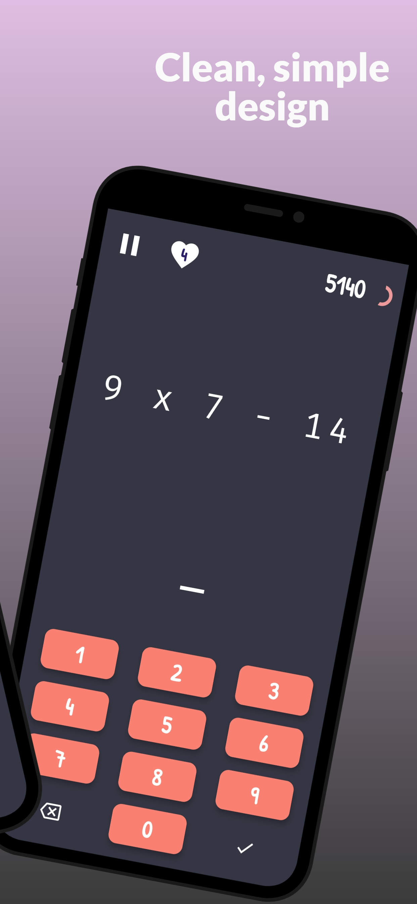
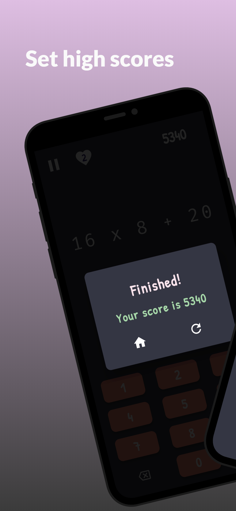
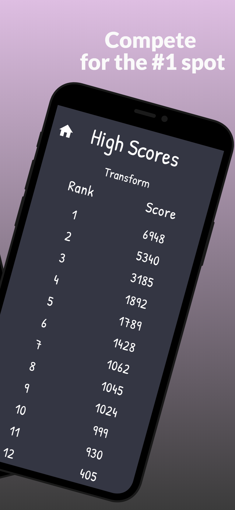

# Food for Thought

A math game written in Dart with Flutter framework. Player has 4 lives and 75 seconds to complete increasingly difficult questions. Previous scores can be viewed in High Scores page.

## Screenshots

App screenshots created with <a href="https://previewed.app/">Previewed</a>

## License

Released under MIT License. See [LICENSE](LICENSE) for more info.
